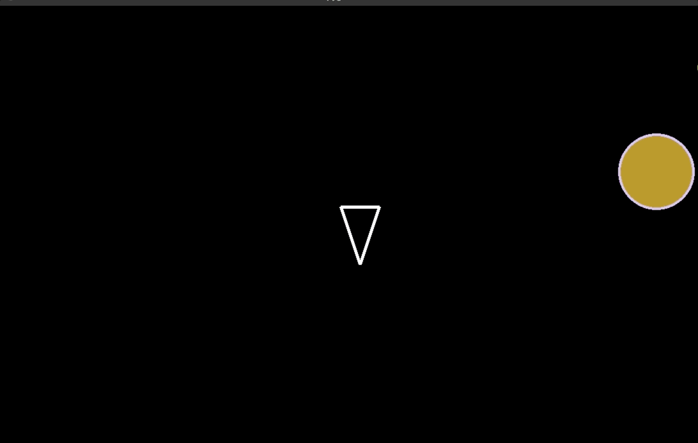

# ☄️ Asteroids

A colorful version of the classic video game of Asteroids.



## 🤔 Motivation
⏰ To take a break from work or study, let's kill some asteroids! You're in a spaceship in outer space, in a galaxy so far away! A field of asteroids is coming your way and you must survive!

## 🚀 Quick Start Online

### Live Site
Navigate to [the online game](https://shantdashjian.github.io/asteroids/)! 

### Play
- Use the arrow keys ⬇️, ⬆️, ➡️, ⬅️ to move around.
- Use the SPACE bar 𓈙 to shoot asteroids.
- Have fun!

## 🚀 Quick Start Locally

### Prerequisite
If you don't have UV, the Python package manager, install it from [here](https://github.com/astral-sh/uv).

### Install the game
```bash
git clone https://github.com/shantdashjian/asteroids
```

### Change directory
```bash
cd asteroids
```

### Start the game
```bash
uv run main.py
```

### Play
- Use the arrow keys ⬇️, ⬆️, ➡️, ⬅️ to move around.
- Use the SPACE bar 𓈙 to shoot asteroids.
- Have fun!

